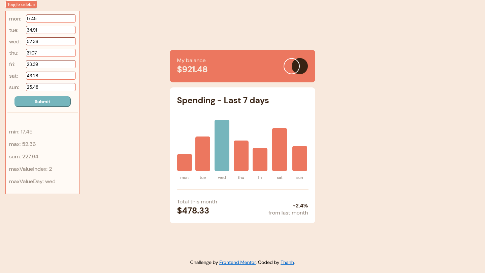

# Frontend Mentor - Expenses chart component solution

This is a solution to the [Expenses chart component challenge on Frontend Mentor](https://www.frontendmentor.io/challenges/expenses-chart-component-e7yJBUdjwt). Frontend Mentor challenges help you improve your coding skills by building realistic projects. 

## Table of contents

- [Overview](#overview)
  - [The challenge](#the-challenge)
  - [Screenshot](#screenshot)
  - [Links](#links)
- [My process](#my-process)
  - [Built with](#built-with)
  - [What I learned](#what-i-learned)
  - [Continued development](#continued-development)
  - [Useful resources](#useful-resources)
- [Author](#author)
- [Acknowledgments](#acknowledgments)

## Overview

### The challenge

Users should be able to:

- View the bar chart and hover over the individual bars to see the correct amounts for each day
- See the current day’s bar highlighted in a different colour to the other bars
- View the optimal layout for the content depending on their device’s screen size
- See hover states for all interactive elements on the page
- Can view and edit chart data points via sidebar toggler

### Screenshot
Desktop w/o sidebar


Desktop w/ sidebar



Mobile


### Links

- Solution URL: [Github Repo](https://github.com/colormethanh/expense-chart-component)
- Live Site URL: [Live site](https://colormethanh.github.io/expense-chart-component/)

## My process

### Built with

- Semantic HTML5 markup
- CSS custom properties
- Flexbox
- CSS Grid
- Mobile-first workflow
- [React](https://reactjs.org/) - JS library
- [Next.js](https://nextjs.org/) - React framework

### What I learned

With this project, I was able to practice and learn how to pass data and manage data across many React components. On first load the react components reads the JSON files and collects the data from it. That process is fairly simple. That difficulties come when I decided to implement the sidebar. The sidebar complicated the project by implimenting user given data. There were many ways to store the data and transfer the data between components. 

To keep the data organized, in the Sidebar.js file, I implemented the convertFormData() function...

```js
function convertFormData(formData) {
  const convertedForm = [] 
  formData.forEach((day, index) => {
    const data = {'day': day[0],'amount': day[1]}
    convertedForm.push(data)
  })
  return convertedForm
}
```
The function was implemented to solve a problem where the form data would be returned as nested lists liked this 
```
[[day, amount], [day, amount]]
```
But I needed the data like this
```
[
  {'day':'mon', 'amount': 5.00},
  {'day':'tue', 'amount': 5.00},
]
```
Although I was content with this solution and proud that I had a good enough understanding of data structures of come up with the solution I still feel like there could be a better solution. Possibly using react states.


### Continued development

In the future I want to continue developing my react skills so that I can able to use it to it's full potential. 


### Useful resources

- [Deploying vite react app to github pages](https://dev.to/shashannkbawa/deploying-vite-app-to-github-pages-3ane) - This helped me learn how to deploy this vite app to github pages
- [Currency input field component]("https://github.com/cchanxzy/react-currency-input-field") - created by @cchanxzy used in Sidebar.jsx

## Author

- Website - [githubrepo](https://github.com/colormethanh)
- Frontend Mentor - [@colormethanh](https://www.frontendmentor.io/profile/colormethanh)

